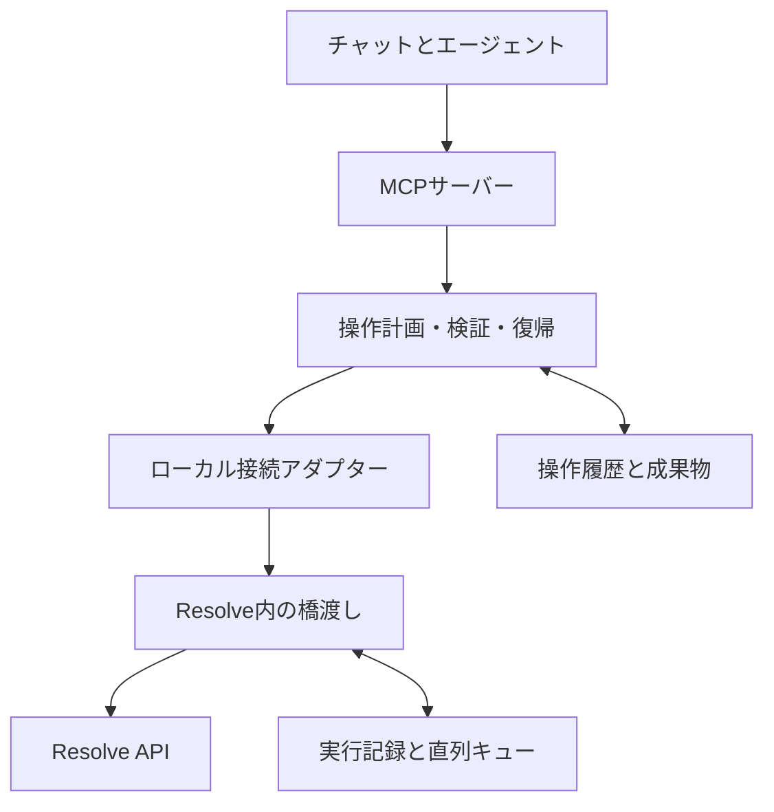

# dr-mcp 設計仕様書

文書ID：DR-SPEC-001 / 仕様版：0.1 / 作成日：2026-09-05

状態：実装前の正本。Mac無料版での実機検証は未完了。

関連文書：[README](../../README.md) / [実装計画書](../planning/20260905-dr-mcp-implementation-plan.md)

## 1. 目的と仕様の優先順位

macOS上のDaVinci Resolve無料版をエージェントが操作し、利用者がチャットで編集意図を伝え、結果を確認・修正できる環境を作る。単発のAPI呼出に加えて、対象の特定、状態保存、実行、検証、復帰までを一つの操作として管理する。

明示されたユーザー要件、承認された本仕様、実装計画、READMEの順に解釈する。要件・インターフェース・数値定義の正本は本書、タスク順序と進捗の正本は実装計画とする。変更時は正本を更新してからコード・テスト・説明を同期する。

本書の「必須」は実装上の要件であり、実装済みの宣言ではない。以下の数値上限、状態名、独自補正式は本プロジェクトの設計値であり、ResolveやMCPの公式仕様そのものではない。

## 2. 要件

| ID | 要件 | 合格の要点 |
| --- | --- | --- |
| DR-001 | Mac・無料版を主対象にする | 実際の無料版で接続・操作を確認する |
| DR-002 | バージョンを利用者に事前入力させない | アプリ情報と接続後の製品情報を自動収集。取得不能はunknownとして扱う |
| DR-003 | バージョン番号より機能確認を優先する | APIの存在、呼出成功、実機検証を別々に記録する |
| DR-004 | チャットから対応済み操作を完結する | 通常操作のたびにコンソール入力や手動クリックを要求しない |
| DR-005 | クリップを一意に特定する | 同名・複数トラック・並べ替え後も固有IDと位置で区別する |
| DR-006 | 基本編集を行う | 読込、範囲指定、配置、分割、削除、並べ替えを検証可能な編集計画として実行する |
| DR-007 | 4項目の基本補正を行う | 明るさ・彩度・コントラスト・暖色／寒色が定義した方向へ変化する |
| DR-008 | 色の数値と方式を明示する | 独自値を標準つまみ値・Kelvin・EVと混同しない |
| DR-009 | 変更結果を確認できる | 対象・時刻・取得方法付きの画像と、状態の差分を返す |
| DR-010 | 保存・復帰できる | 元のタイムライン／カラーバージョンへの参照を保持し、復帰結果も確認する |
| DR-011 | 指定条件で書き出す | 利用可能な形式を調べ、ジョブ終了と実ファイルを確認する |
| DR-012 | 失敗を成功と報告しない | rejected・failed・partial・uncertain等を区別する |
| DR-013 | 再送で編集を重複させない | 操作IDを永続化し、実行結果が不明なら自動再実行しない |
| DR-014 | 操作範囲を限定する | ローカル認証、固定操作の許可リスト、1実行者、素材の非破壊を実装する |
| DR-015 | 導入・更新・診断を再現可能にする | 実機情報と検証記録から対応表を生成し、設定を保持して更新できる |

初期対象は、SDR・固定フレームレートの単純な素材、映像1トラックとそれに関連する音声、ハードカット、全クリップ均一の補正である。既存の複雑なタイムラインも読み取り可能な範囲は提示するが、保持できない要素があれば変更前に停止する。

マスク、トラッキング、高度なグレード、複雑なFusion、マルチカム、速度変更、トランジション、HDR／Logの自動正規化、自動ショットマッチ、遠隔公開は初期対象外。単純なクリップで成立した実装を、これらにも対応していると表示してはならない。

## 3. 根拠と未確定事項

| 根拠 | 確認内容 | 設計での扱い |
| --- | --- | --- |
| [S1：既存MCP](https://github.com/samuelgursky/davinci-resolve-mcp#free-edition-in-app-bridge) | 無料版でアプリ内スクリプトを橋渡しとして使う方式とMacの動作報告 | 主接続方式の検証候補。Blackmagicによる全バージョン保証とは扱わない |
| [S2：公開APIリファレンスの写し](https://github.com/samuelgursky/davinci-resolve-mcp/blob/main/docs/reference/resolve_scripting_api.txt) | CDL、カラーバージョン、タイムライン、画像・レンダー関連のAPI契約 | 実機同梱READMEと照合してアダプターを作る |
| [S3：既存MCPのカラー検証](https://github.com/samuelgursky/davinci-resolve-mcp/blob/main/docs/kernels/color-grade-kernel.md) | グラフ操作・DRX適用・読戻しの制限や実機検証の扱い | 不明なプロパティ名や、グレードを自動追加できるという仮定を避ける |
| [S4：MCP公式開発資料](https://modelcontextprotocol.io/docs/develop/build-server) | サーバーとツールの実装方式 | MCPは公式SDKを使い、独自のJSON-RPC実装を作らない |
| [S5：MCP公式Python SDK](https://github.com/modelcontextprotocol/python-sdk) | Python実装の提供 | 実装時に採用した版をロックし、実クライアントと疎通試験する |

確認日：2026-09-05。上記の既存プロジェクトは参考資料であり、自動的な依存先ではない。実装に取り込む場合は採用コミット・ライセンス・取り込む範囲を記録する。本仕様作成時点では第三者のコードを転載していない。

P0で解決する事項は、無料版内での起動経路、Pythonの認識、UIを停止させない常駐方法、Resolve APIを安全に実行できるスレッド／イベントループ、カラーバージョンの複製・適用・復帰の実挙動である。APIのメソッド名を推測してこれらを埋めない。

## 4. ユーザー体験

### 4.1 導入と開始

1. セットアップがMac上のアプリとスクリプト環境を探す。複数の候補があれば選択を求める。
2. ユーザー領域に橋渡しスクリプトと設定を配置し、既存設定との差分を示す。
3. 対象版で必要な場合、利用者がResolveのScriptsメニュー等から橋渡しを起動する。
4. MCPクライアントが接続し、版・機能・現在のプロジェクトを確認する。
5. チャットから対応済み操作を実行する。

「チャットだけ」は接続成立後の通常編集を指す。OSが要求する許可、初回登録、Resolve再起動後の橋渡し起動まで無条件に自動化できるとは扱わない。無料版の起動経路が成立しない環境では、その事実と具体的な不足を返す。

### 4.2 編集指示の処理

「3番目を少し明るくして」では、最新一覧から対象を特定し、現在の版・編集状態を取得し、小さな補正に変換して実行し、対象付きプレビューと変更量を返す。名前・番号・再生位置が矛盾する場合にだけ対象を確認する。通常の可逆操作に毎回の承認を挟まない。

### 4.3 再起動と切断

切断時は操作を保留し、Resolveと橋渡しの状態を区別して診断する。再接続後はsession IDを更新し、保存済みの操作記録と実機状態を照合してから再開する。再起動前のAPIオブジェクト参照を再利用しない。

## 5. アーキテクチャ



| コンポーネント | 責務 | 境界 |
| --- | --- | --- |
| MCPサーバー | ツールの公開、型検証、画像・結果応答 | Resolveのネイティブモジュールを直接ロードしない |
| アプリケーション層 | 編集計画、前提検証、操作状態、復帰 | 会話モデルにDB編集やAPI名の生成を任せない |
| 接続アダプター | 認証、要求送信、状態照会、期限 | 無料版はin-app方式。Studio直接方式は後から追加可能 |
| アプリ内の橋渡し | 固定操作の実行、実機情報収集、キュー | 公開されたスクリプト経路で得た権限内で動く |
| APIアダプター | バージョン・機能差、引数・返値変換 | 対応する実APIと検証根拠を一か所に集約 |
| 履歴・成果物 | 操作ID、計画、前後状態、画像、出力検査 | 素材ファイルとプロジェクトDBを直接書き換えない |

MCPは同一Mac上のstdioを初期輸送にする。橋渡しとの通信だけに認証付きloopback HTTPを使う。橋渡しの受信処理とAPI実行を分け、API呼出は実機で確認した実行文脈に直列化する。単なる無限HTTPループでResolveのUIを占有する実装を合格にしない。

## 6. 機能検出と互換性

### 6.1 接続前

標準のアプリ配置候補と明示されたアプリパスを調べ、`Info.plist`から表示名・版・実行ファイルを取得する。見つからない場合だけ探索範囲を追加する。アプリ情報だけで無料版／Studioを断定できなければeditionはunknownにする。MacのCPUと、サーバー／橋渡し用Pythonの版・アーキテクチャを収集する。

`PYTHON3HOME`やユーザーScriptsディレクトリの適合は実機で確認する。CLI用PythonがあることとResolveがPythonを認識することは別条件。設定変更は対象アプリに必要な範囲に限定し、再起動後の保持も検証する。

### 6.2 接続後

製品名・版、起動セッション、公開API、実際の読み取り結果を収集する。利用者のプロジェクトを変更するプローブは通常診断に含めない。変更系は、実行を指示された専用の実機試験で検証する。

```json
{
  "schema_version": 1,
  "session_id": "example-session",
  "environment": {
    "os": "macos", "arch": "arm64", "edition": "unknown",
    "resolve_version": null, "transport": "in_app_http"
  },
  "features": {
    "color.basic.cdl": {
      "presence": "observed", "verification": "untested",
      "reason": "write_probe_not_run", "evidence_id": null
    },
    "color.temperature.native": {
      "presence": "unknown", "verification": "untested",
      "reason": "no_verified_adapter", "evidence_id": null
    }
  }
}
```

`presence` は `observed | missing | unknown`、`verification` は `untested | passed | failed`。ネイティブプロキシの `callable()` だけで検証成功にしない。バージョン番号がunknownでも、必要な能力を確認できれば利用可能とする。番号が既知でも未検証の操作を検証済みと表示しない。

対応表のキーはOS、CPU、edition、Resolveのbuild、橋渡しPython、MCP版、APIリファレンスのハッシュ。更新で一致しなくなった検証結果は履歴として保持し、現環境へ自動流用しない。

## 7. 橋渡し通信と実行境界

### 7.1 通信契約

`GET /v1/health`、`POST /v1/command`、`GET /v1/operations/{operation_id}` を定義する。すべて認証する。`/command` は以下のJSONを受け付け、長い処理はacceptedと操作IDを返す。

```json
{
  "protocol_version": 1,
  "request_id": "example-request",
  "operation_id": "example-operation",
  "session_id": "example-session",
  "action": "color.apply_basic",
  "expected_context": {
    "project_id": "example-project", "timeline_id": "example-timeline",
    "revision_token": "example-revision"
  },
  "arguments": {"clip_id": "example-clip", "brightness": 0.02}
}
```

エージェントに任意のメソッド名やコードを送らせない。`action` はサーバー側の固定ディスパッチ表に対応する。ネイティブAPIオブジェクト、pickle、Python式は通信しない。

### 7.2 認証と制限

初期設定で256bitのランダム鍵を生成し、ユーザー専用ディレクトリを0700、鍵ファイルを0600で保存する。鍵は本文・引数・ログへ出さない。

署名対象はUTF-8で `METHOD + "\\n" + PATH + "\\n" + TIMESTAMP + "\\n" + NONCE + "\\n" + BODY_SHA256` とする。METHODは大文字、PATHは送信した絶対パスでqueryは初期プロトコルでは禁止、TIMESTAMPはUTC Unix秒の10進整数、NONCEはランダム16byteの小文字hex、BODY_SHA256は送信したbody bytesのSHA-256小文字hexとする。GETのbodyは空bytes。ヘッダーは `X-DR-Timestamp`、`X-DR-Nonce`、`X-DR-Signature`。署名はHMAC-SHA256小文字hexとし、定時間比較する。両側に同じテストベクトルを持つ。

bind先は`127.0.0.1`。Hostは接続先と一致するものだけを許可し、ブラウザ由来のOrigin付き要求を拒否する。nonceは使用済みを拒否し、時計許容差は既定30秒。初期上限はコマンド本文1MiB、画像応答12MiB、キュー32件。これらは設定可能にし、超過は実行前に拒否する。

ネットワーク上の公開、任意ファイル読取、任意コード実行、OSコマンド実行をツールとして公開しない。素材・出力パスは設定した作業ルート内を正規化して検証し、symlink経由の逸脱も拒否する。許可ルートの追加は利用者が依頼した素材・出力先に合わせて行う。

### 7.3 直列化と期限

Resolve APIへのアクセスは橋渡し内の単一実行キューに集約する。クライアントが複数でも、変更操作は同時に一つだけ受け付ける。読み取りも変更途中の不整合を避けるためAPI実行キューを通す。

| 処理 | 初期期限 | 超過時 |
| --- | ---: | --- |
| 接続／health | 3秒 | 未接続を返す |
| 通常の読取 | 10秒 | timeoutを返し、キャッシュを現在値と偽らない |
| 画像取得 | 20秒 | 未検証画像で成功扱いしない |
| 一つの短い変更 | 30秒 | 結果不明ならuncertain。新たな変更を保留 |
| レンダー | 非同期 | job IDで状態照会。MCPの一回の要求で完了まで待ち続けない |

期限はクライアントの待機を止めるもので、実行済みAPIを巻き戻すものではない。ハングしたネイティブ呼出を別スレッドから強制終了しない。再接続して状態を確定するまで同じ変更を再送しない。

## 8. 状態・ID・操作結果

### 8.1 操作対象

`session_id`、`project_id`、`timeline_id`、`clip_id` と、処理に必要なトラック・フレーム範囲を使う。固有ID APIがない場合の代替は「セッション内ID＋位置・素材・範囲の指紋」とし、衝突があれば拒否する。代替IDを再起動後の同一性保証には使わない。

`revision_token` は対象タイムラインの正規化した構造から作るハッシュ。項目ID、トラック、開始・終了、素材範囲、関連音声、検出可能なグレード版を含める。取得できない手動グレード値まで検出できるとは表示しない。比較範囲を結果に記録する。

### 8.2 共通応答

```json
{
  "schema_version": 1,
  "operation_id": "example-operation",
  "status": "succeeded",
  "changes": [{"clip_id": "example-clip", "field": "brightness", "before": 0, "after": 0.02}],
  "verification": {"api": "passed", "state": "passed", "visual": "not_run", "render": "not_run"},
  "artifacts": [],
  "recovery": {"available": true, "snapshot_id": "example-snapshot"},
  "warnings": [],
  "error": null
}
```

statusは `accepted | running | succeeded | rejected | failed | partial | uncertain | cancelled`。各verification値は `passed | failed | not_run | unavailable`。色調整でAPIと版の切替だけ確認した場合、数値の完全な読戻しはunavailableとし、確認できた版の切替を別の証拠へ記録する。画像未確認を「画も確認済み」と要約しない。

`succeeded` はその操作が定義した最低確認条件を満たした状態であり、映像の完成度の保証ではない。最低条件は機能別に定義する。ログ・チャット要約でもverificationの区別を維持する。

### 8.3 永続化と復帰

サーバー側はSQLiteに操作ID、要求ハッシュ、計画、状態、前後の参照、出力・検査記録を保持する。橋渡しにも操作IDとネイティブ呼出の開始・完了を記録する。同じ操作ID・同じ要求は既存結果を返す。同じIDで別の内容なら`IDEMPOTENCY_CONFLICT`。

ネイティブ変更とSQLiteは一つのトランザクションにならない。書込後にプロセスが落ちた場合のexactly-onceは保証せず、`uncertain`として実機を照合する。再送時に「まだ結果がないから再実行」をしてはならない。

基本の遷移は `prepared → running → succeeded`。実行前拒否はrejected、途中失敗で一部反映はpartial、確定できない場合はuncertain。cancelは未実行分だけを取り消し、実行済みの変更には別のrestore操作を使用する。

## 9. MCPツール契約

全変更ツールに `operation_id` と `expected_context` を必須とする。ツール表の入力欄では繰り返しを省略する。型はP1でJSON Schema／Pythonモデルとして実装する。読取はreadOnly、変更は実態に合うannotationsを付ける。annotations自体をアクセス制御には使わない。

| ツール名 | 主入力 | 出力・最低確認条件 |
| --- | --- | --- |
| `resolve_status` | なし | 検出結果、接続状態、実際の現プロジェクト |
| `resolve_capabilities` | 任意のfeature名 | presence・verification・根拠 |
| `list_media` | bin ID、cursor | 素材ID・参照情報のページ |
| `list_timelines` | project ID | タイムラインIDと基本情報 |
| `list_clips` | project／timeline ID | クリップID・フレーム範囲・関連音声・revision |
| `import_media` | 正規化されたpaths | 読み込めた素材と失敗項目を照合 |
| `plan_timeline_edit` | source timeline、編集要求列 | 正規化segment列、変更差分、未対応要素。Resolveの変更なし |
| `apply_timeline_edit` | plan ID、plan hash | 新タイムライン、読戻し構造一致、保存結果 |
| `get_basic_color` | clip ID | 管理値とnative readback可否。未知の値はnull |
| `set_basic_color` | clip ID、絶対値patch、backend | 補正先の版・API適用・保存・復帰先を確認 |
| `preview_clip` | clip ID、clip内frame offset | 実対象・時刻・画像。対象一致を確認 |
| `render_timeline` | 出力先、形式／preset、範囲 | 対象timelineを固定したrender job ID |
| `operation_status` | operation ID | 非同期処理と検証状態 |
| `cancel_operation` | operation ID | 取消範囲と、取消不能・反映済み部分 |
| `restore_snapshot` | snapshot ID | 元状態への復帰と保存の確認 |

大量の素材一覧は既定100件でページングする。全件を取得したふりをせず、cursorと総数既知／不明を返す。プレビュー画像は、ローカルパスの文字列だけでなくMCPの画像コンテンツとして返せるようにする。

## 10. タイムライン編集

### 10.1 正規化形式

内部では整数フレームと有理数のfpsを使う。すべての範囲は半開区間`[in_frame, out_frame)`。APIに包含終端を渡す場合はアダプターで変換し、1フレーム素材・終端の試験で校正する。秒からフレームへの変換はDecimal等を使って最寄りへ丸め、ちょうど中間は正方向へ丸める。元の秒指定と量子化差を結果へ記録する。

```json
{
  "schema_version": 1,
  "fps": {"numerator": 24000, "denominator": 1001},
  "segments": [{
    "segment_id": "example-segment", "media_id": "example-media",
    "source_in_frame": 48, "source_out_frame": 168,
    "record_start_frame": 0, "video_track": 1,
    "audio_policy": "preserve_linked", "source_clip_id": null
  }]
}
```

初期版は素材とタイムラインのfps一致を要求し、不一致・VFRを黙ってリタイムしない。ドロップフレームはタイムコード表現の規則として扱い、フレーム演算と分離する。未校正のタイムコード形式で自動seekしない。

### 10.2 編集操作の意味

| 操作 | segment列への変換 |
| --- | --- |
| 配置 | 指定素材とsource範囲を追加し、record位置を指定 |
| トリム | 元のsource範囲を縮小。初期版は後続を詰める |
| 分割 | 指定frameで、同じ素材を参照する2区間へ分ける |
| 削除 | 指定segmentを除き、初期版は後続を詰める |
| 並べ替え | segment順を変更し、record位置を再計算 |

操作は最終segment列に正規化してから実行する。重複・不足・不正なsource範囲・未対応要素を事前に検査する。音声は映像との対応を保持し、音声を落として処理成功にしない。

### 10.3 実行方式

元のタイムラインを保存し、編集結果は新しい作業タイムラインへ構築する。`CreateTimelineFromClips`、`AppendToTimeline`等は実機の参照とプローブに基づく候補であり、存在しない汎用trim／moveメソッドを仮定しない。[API契約の参照](https://github.com/samuelgursky/davinci-resolve-mcp/blob/main/docs/reference/resolve_scripting_api.txt)

既存タイムラインから再構築する際は、保持対象の映像・音声・管理グレード・対応するマーカーを収集する。非対応のエフェクト、速度変更、字幕、トランジション、複雑なグレードが見つかれば変更を拒否する。1トラックであるだけで単純なタイムラインとは判定しない。

グレード済みのMCP管理クリップはsource clipとresult clipの対応表を保持し、検証済みのCopyGrades等で引き継いで版・プレビューを確認する。引継ぎ不能なら元タイムラインを維持する。再構築後は新しいIDを取得し、旧IDを再利用しない。

成功条件は計画した範囲・順序・尺・音声対応が読戻し結果と一致し、保存されたこと。部分構築で失敗した場合は元タイムラインへ戻し、途中成果物を診断対象として記録する。

## 11. 基本色補正

### 11.1 公開パラメーター

| 名前 | 中立値 | 初期範囲 | 意味 |
| --- | ---: | ---: | --- |
| `brightness` | 0 | -0.2〜0.2 | RGB信号値の加算 |
| `saturation` | 1 | 0〜2 | CDL彩度 |
| `contrast` | 1 | 0.5〜1.5 | 信号値0.5を中心にした傾き |
| `warmth` | 0 | -1〜1 | 赤・青ゲインによる暖色／寒色 |

全値は絶対値。未指定の値は管理記録の値を引き継ぐ。「さらに少し」はエージェントが現在値を読んで新しい絶対値へ変換する。再送で値を累積させない。NaN、Infinity、bool、範囲外を実行前に拒否する。

初期backendは`cdl_basic_v1`。CDLへの変換は以下を正本とする。

```text
g = [1 + 0.15 * warmth, 1, 1 - 0.15 * warmth]
Slope[i]  = contrast * g[i]
Offset[i] = (0.5 * (1 - contrast) + brightness) * g[i]
Power     = [1, 1, 1]
Saturation = saturation
```

同じ入力・backend版から同じ係数を生成する。ノード番号と文字列形式は実機APIに合わせてアダプターで変換する。前段・後段の色変換とクリッピングにより実画像の応答は変わるため、係数計算の単体テストだけでは画の品質を合格にしない。

`temperature_kelvin`、`temperature_native`、`exposure_ev`は初期APIに追加しない。利用者が厳密な値を要求した場合は`UNSUPPORTED_COLOR_SEMANTICS`を返し、warmthへ黙って置換しない。ネイティブの色温度が検証可能になった場合は別feature・別backendとして追加する。

### 11.2 補正の適用先と既存グレード

MVPは、MCPが準備・管理する単一補正ノードを対象とする。ノード生成・カラーバージョンの引継ぎ方法はP0で確認する。元の版を保持し、操作ごとに新しいローカル版へ適用する。既存のノード1に無条件で上書きしない。

ノードが1個であることは無補正の証明ではない。管理外のクリップは、元の版を確実に保持し、補正用の初期状態を作れる検証済み経路がある場合にだけ管理下へ取り込む。必要な初期化が既存グレードを失う場合は、その動作を通常の「少し明るく」と同一視しない。MVPではその対象の補正を非対応と返せる。

APIから数値を読み返せない場合、`get_basic_color`は `source=managed_state` と `native_readback=false` を付ける。管理外の現在値はnull。手動グレード変更の検出範囲に限界があるため、同じ管理版の手動変更を完全に検出できるとはしない。

### 11.3 色空間と検証

最初の適合試験は、Rec.709 SDRとして解釈が明確な無補正素材・プロジェクト設定で行う。色空間がunknown、HDR、Log、ACES等なら自動補正を実行せず、素材設定を特定する。新しい色空間へ拡張する場合はbackendの前提と検証素材を追加する。

グレースケール、RGBパッチ、低コントラスト素材、実際の短いSDRクリップで中立・各軸・組合せ・復帰を評価する。飽和済みパッチを方向判定に使わない。独自のwarmthを正確なホワイトバランス変換と表示しない。

## 12. プレビューと書き出し

`preview_clip`はclip IDとclip内frame offsetから対象位置へ移動し、実際のclip ID・フレーム位置を確認して画像を取得する。Colorページのサムネイルを第一候補とし、必要なら検証済みの静止画出力へ切り替える。取得方式、サイズ、タイムコード、色空間の把握状況、取得時刻を付ける。

変更前後は同じ対象・フレーム・出力条件で比較する。キャッシュ更新が確認できなければ`PREVIEW_NOT_FRESH`。画像取得に成功しただけでグレード検証を完了にしない。取得前後に利用者が別のクリップへ移動した場合は結果を破棄する。

書き出しは環境が返す利用可能なformat／codec／presetから選ぶ。H.264等の特定形式が無料版で常に使えるとは仮定しない。指定条件が不可能なら、代替を勝手に選ばず条件の違いを返す。

操作にはtimeline ID、範囲、出力ディレクトリ、一意のファイル名を固定する。既存ファイルの上書きは既定でしない。レンダー中はプロジェクトを変更する新規操作を保留し、別タイムラインへの切替がジョブに与える影響を実機で確認する。

成功条件はjobの完了状態、生成ファイルの存在と非ゼロサイズ、指定した解像度・尺・映像／音声ストリームの照合。メディア検査にffprobe等を使う場合は依存として明示し、存在しない環境で検証済みを返さない。ジョブの削除で出力ファイルも取り消せたとは扱わない。

## 13. エラーと復旧

| コード | 意味 | 次の動作 |
| --- | --- | --- |
| `APP_NOT_FOUND` | Resolveの配置を特定できない | アプリ候補の追加指定 |
| `BRIDGE_NOT_RUNNING` | アプリ内の橋渡しが未起動 | 対象環境で確認した起動手順を提示 |
| `PYTHON_NOT_DETECTED` | ResolveがPythonを認識しない | Python探索・起動経路を診断 |
| `AUTH_FAILED` | 署名・nonce等が不正 | 実行せず停止 |
| `PROTOCOL_MISMATCH` | 橋渡しとの契約不一致 | 対応する構成へ更新 |
| `CAPABILITY_UNAVAILABLE` | 必要機能を使用できない | 機能と理由を明示 |
| `CONTEXT_CHANGED` | 対象プロジェクト／編集状態が変化 | 再取得・再計画 |
| `UNSUPPORTED_TIMELINE` | 保持できない編集要素がある | 元を維持し、不足する対応を報告 |
| `UNSUPPORTED_COLOR_SEMANTICS` | 指定した色の意味に未対応 | 数値体系を区別して説明 |
| `COLOR_SPACE_UNKNOWN` | 補正の前提が未確定 | 素材と色設定を特定 |
| `PREVIEW_NOT_FRESH` | 更新済み画像と確認できない | 再取得または別取得方式 |
| `IDEMPOTENCY_CONFLICT` | 同一操作IDで異なる要求 | 新規操作として再計画 |
| `OPERATION_UNCERTAIN` | 実行結果を確定できない | 新規変更を保留し実機を照合 |
| `SAVE_FAILED` / `RESTORE_FAILED` | 保存／復帰を確認できない | 復帰先と実際の状態を返す |
| `RENDER_FAILED` | レンダー失敗または検査不一致 | job・出力・検査結果を提示 |

通信再試行は読み取りのみ既定1回。変更は操作ID照会で結果を確認する。映像を見て補正を反復する上位処理は既定3回で終了し、未達なら最後の結果と未達理由を返す。上限は実装上の初期値で、ユーザーが指定した回数を優先する。

## 14. 配置と開発構造

| パス | 役割 |
| --- | --- |
| `src/dr_mcp/server.py` | MCP公開とstdio |
| `src/dr_mcp/contracts/` | DTO、schema、エラー、feature ID |
| `src/dr_mcp/application/` | 計画、操作、検証、復帰 |
| `src/dr_mcp/adapters/` | 接続、API差分、メディア検査 |
| `src/dr_mcp/state/` | SQLite、履歴、migration |
| `bridge/` | アプリ内の橋渡し、起動プローブ |
| `scripts/` | 導入・診断・実機検証 |
| `tests/unit/` | 純粋関数と状態遷移 |
| `tests/integration/` | プロセス間・MCP・通信契約 |
| `tests/live/` | 実機の接続・編集・色・出力試験 |
| `docs/compatibility/` | 環境別の検証記録と対応表 |

上記は将来配置。現時点で存在するとの宣言ではない。

ユーザー状態は `~/Library/Application Support/dr-mcp/` 以下へ置く。設定、server.sqlite、bridge.sqlite、操作別artifactsを分離する。元動画・秘密鍵・個人プロジェクト・実機の詳細なローカルログをgitに登録しない。共有する検証記録はパスや個人素材名を除いたMarkdownにする。

Pythonの初期候補は3.11系とし、実機との整合をP0で確認する。MCP側と橋渡し側のPythonは別環境でもよい。橋渡しは標準ライブラリを基本とし、MCP SDKをResolve内へ埋め込まない。採用SDKと依存関係はP1でlockfileに固定する。

## 15. 完成の定義

Mac無料版の実機で、導入、接続、機能検出、素材読込、トリムと配置、4項目補正、同フレームの比較、復帰、レンダーと出力検査を一巡し、再起動後にも履歴と状態が整合すること。

CIの模擬APIだけが成功した状態は実装進捗として記録できるが、製品の無料版対応を完了にしない。未検証の色空間・版・CPUについてはunknownを維持する。対応表とREADMEには、検証された範囲を正確に反映する。
